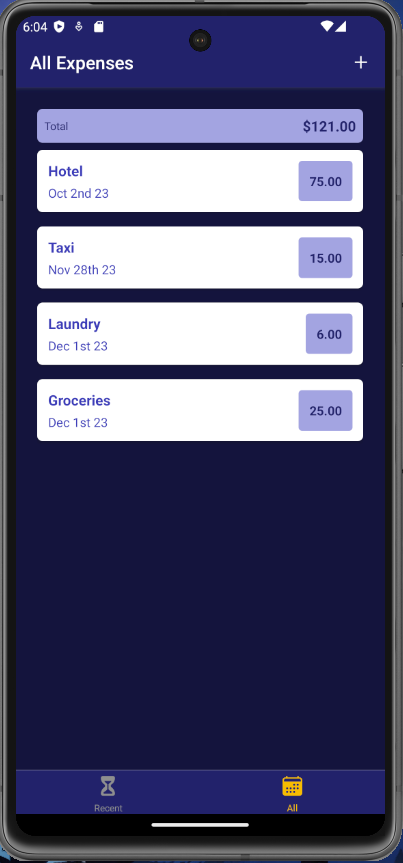
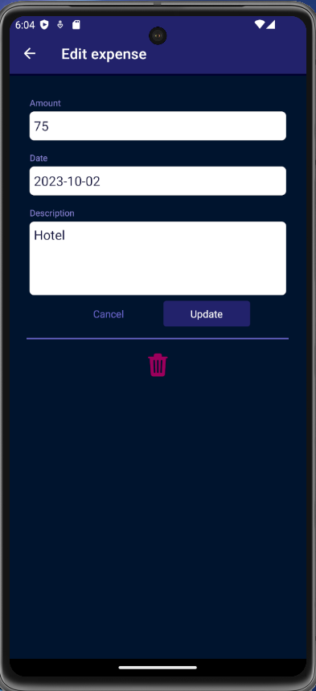

# Guess My Number - React Native

This is an React native application developed to learn some and put in action some concepts like:

 - Component creation for reuse
 - Routes
 - Icons
 - State management
 - Http requests
 - Handling user input

The app goal is to manage the user expenses.

## Screenshots

